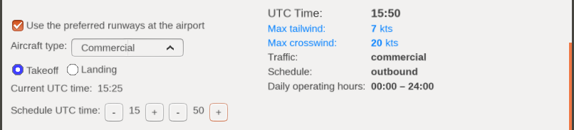
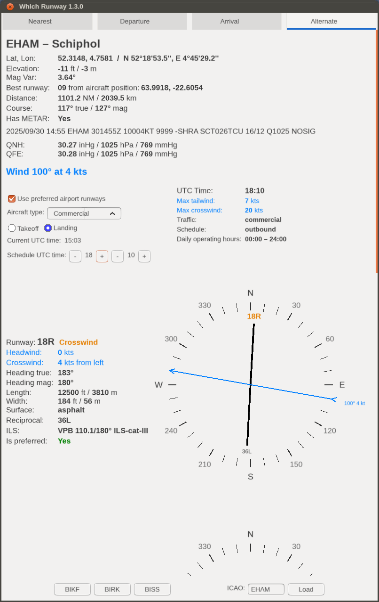
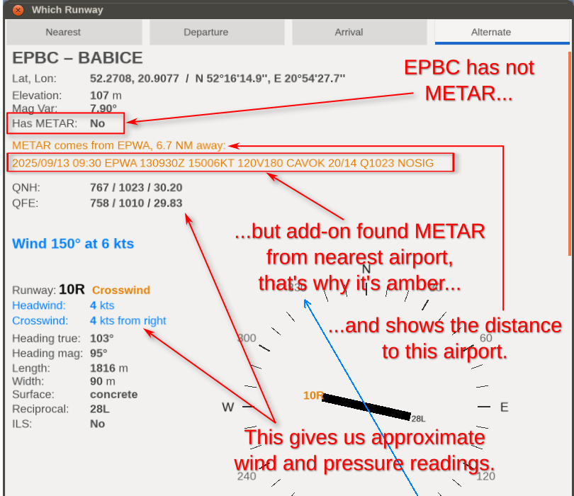
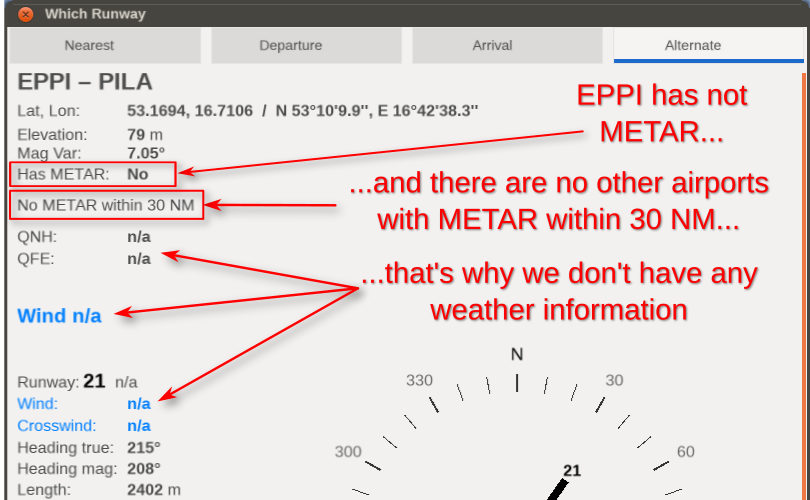
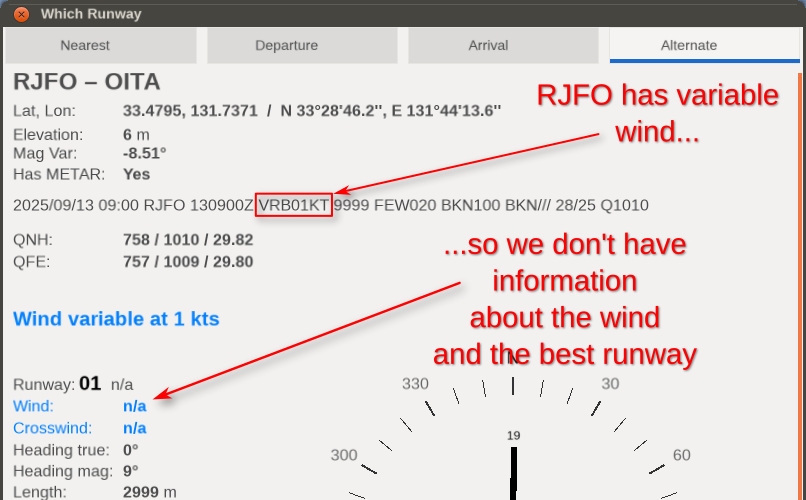
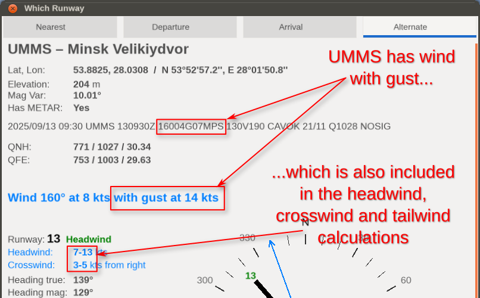
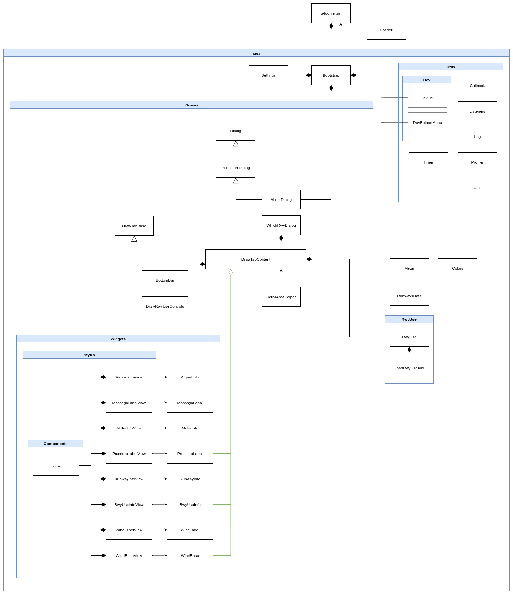

FlightGear "Which Runway" Add-on
================================

This add-on uses the METAR to indicate which runway is best for takeoff or landing. It also calculates headwind, crosswind and tailwind forces for the each runway of the airport.

## Installation

Installation is standard:

1. Download "Which Runway" add-on and unzip it.

2. In Launcher go to "Add-ons" tab. Click "Add" button by "Add-on Module folders" section and select folder with unzipped "Which Runway" add-on directory (or add command line option: `--addon=/path/to/which-runway`), and click "Fly!".

## Using

This add-on adds a "Which Runway" item to the main menu, from which you select "Runways". A dialog box will open with 4 tabs:

1. **Nearest** displays the nearest airport, which will be automatically updated during the flight. At the bottom, there's a field to enter the ICAO code of any other airport and you also find buttons with the nearest airports within a 50 nautical mile radius. If you reach a different nearest airport, the data will always change to that nearest airport. To prevent the nearest airport from changing automatically, you can check the "Hold update" checkbox.
2. **Departure** show the airport selected as departure in Route Manager. This airport is automatically change only when you change it in Route Manager. At the bottom you can force a refresh of the METAR with the "Update METAR" button.
3. **Arrival** show the airport selected as arrival in Route Manager. This airport is automatically change only when you change it in Route Manager. At the bottom you can force a refresh of the METAR with the "Update METAR" button.
4. **Alternate** where at the bottom you can use input field for entering the ICAO code of any airport. This is the best place to enter any ICAO code because here the airport will never be changed by the program. Here you will also find buttons with the nearest airports within a 50 nautical mile radius.

Each tab contains information about the airport, the METAR, and the runways and their winds. Runways are sorted by which one is most exposed to headwinds. Wind data is always taken from the actual METAR. The METAR will be updated automatically every 15 minutes by FlightGear's mechanisms or by using the "Load"/"Update METAR" buttons.

If the airport does not have a METAR, the METAR is taken from another nearest airport, within a maximum range of 30 NM. A warning is then displayed, indicating which airport the METAR is from and how far away that airport is. This is useful in situations where smaller airports don't have METARs but are close enough to another larger airport that it can be assumed there won't be much, if any, difference in weather. This allows you to obtain some weather conditions, such as wind and barometric pressure, even at airports without a METAR, which wasn't so easily possible without this add-on.

If there is no other airport with a METAR within 30 NM, information about the airport and its runways will be displayed, but without wind and other weather data. This means that the runways are displayed as they appear in the database and are not sorted by best wind.

**NOTE**: To download and use METAR data with this add-on, the add-on requires the "Live Data" weather scenario to be enabled. You can use this add-on with the weather scenario in offline mode, but wind and METAR data will not be displayed.

## Preferred Runways

Some airports, especially larger ones, include a file with the extension `*.rwyuse.xml` in their scenery. This file defines schedules for specific aircraft types and the preferred runways for takeoff and landing within a given schedule. The `rwyuse.xml` file also contains information about the maximum allowable tailwind and crosswind. If the first column of preferred runways does not meet the wind requirements, the next column is considered, and so on, until a column containing preferred runways is found. This means that the preferred runway may not necessarily be the one best located for the headwind. This is due to noise reduction, traffic volume, runway length, and other factors.

"Which Runway" attempts to load the `rwyuse.xml` file, if it exists for a given airport, and takes into account the preferred runways there.

If the airport has an `rwyuse.xml` file, it will be visible with an additional set of controls and information.

Controls:

1. **Use preferred airport runways** checkbox – this will be enabled by default to use information from `rwyuse.xml`. However, you can always uncheck this option, which means disabling the `rwyuse.xml` file, and then the runways will be presented simply by the highest headwind.
2. **Aircraft type** combobox – schedules for specific aircraft types are created in the `rwyuse.xml` file. Therefore, first make sure you have the correct aircraft type set:
    1. `Commercial` – commercial airliners,
    2. `General Aviation`,
    3. `Ultralight`,
    4. `Military`.

    Not all airports have schedules for `Ultralight` and `Military`. If `Ultralight` is not present, `General` will be used, even though `Ultralight` is selected. If `Military` is not present, `Commercial` will be used. And if `General` is not specified, `Commercial` will also be used. Changing the aircraft in any tab will change the aircraft in every tab. This is convenient because we don't have to repeat this for every tab.
3. Radio buttons **Takeoff** and **Lending** – here you must select whether you are interested in taking off or landing at a given airport. For the `Departure` tab, `takeoff` is selected and cannot be changed. For `Arrival`, `landing` is always selected. The values ​​can be changed on the `Nearest` and `Alternate` tabs.
4. **Current UTC time** simply displays the current UTC time in the simulator to help set the schedule time. This time automatically updates.
5. **Schedule UTC time** – here you should select the UTC time for takeoff or landing. As I mentioned, airports have their schedules based on time intervals in UTC, so it's important to enter the correct time. For example, if your flight will take another 2 hours, you should set the UTC time 2 hours ahead for landing. You will then receive the correct landing schedule.

On the right side, you'll find additional information:

1. **UTC Time** – the time used for the schedule. Remember to set the correct takeoff/landing time, which won't necessarily be the current time.
2. **Max Tailwind** – the maximum allowable tailwind. If the runway has a tailwind greater than the value specified here, it is excluded from the preferred runways.
3. **Max Crosswind** – the maximum allowable crosswind. If the runway has a crosswind greater than the value specified here, it is excluded from the preferred runways.
4. **Traffic** – the aircraft type used. This should be the same type as you selected in the "Aircraft type" combo box, but this won't always be the case. If the airport doesn't contain any data for the selected aircraft, this value is changed as described above, for the "Aircraft type" option.
5. **Schedule** – the name of the schedule from the `rwyuse.xml` file that corresponds to the given UTC time and aircraft/traffic. If `n/a` is displayed, it means the airport is not operational for the selected aircraft type at the selected UTC time. Runways will then be displayed simply by the highest headwind, without preferred runways. The values ​​found here may vary and depend on the airport, but here are some of them:
    - `night` – night schedule, where preferred runways may be selected specifically for noise reasons;
    - `day` – a general schedule for the entire day;
    - `offpeak` – the end of peak traffic;
    - `inbound` – heavy traffic arriving at the airport, in which case there may be more preferred runways for landing;
    - `outbound` – heavy traffic departing from the airport, in which case there may be more preferred runways for takeoff;
    - `general`, `ga` – most often one schedule for all general aviation traffic;
    - `commercial` – most often one schedule for all airline traffic;
    - `always` – some general schedule.

If you're using preferred runways for an airport, then:

1. The preferred runways will be displayed first. They will have the additional information **Is preferred: Yes**. Typically, there will be only one runway, or possibly two, for large airports. This is the runway you should select.
2. Not all runways will be displayed here, only those that were on the airport's preferred list for a given schedule.
3. If a runway doesn't meet the maximum tailwind or crosswind criteria, it will be marked with the additional information **Is preferred: No**.
4. If no runway is suitable due to unfavorable wind conditions, everyone will receive the information **Is preferred: No**. You can then deselect the "Use preferred airport runways" option and simply check the runways by the highest headwind.
5. If the wind is variable, the criteria for max tailwind and crosswind are not checked, which means that no runways are rejected from the preferred ones.

### Preferred runways and compatibility issues

Currently, FlightGear uses the airport's preferred runways (if any) only for computer-controlled traffic. Therefore, if you start a session on a runway, your aircraft will be placed on the runway based on the highest headwind, without taking into account the airport's preferred runways. The good news is that this is recognized and marked with a FIXME comment in the FlightGear code :)

Other add-ons, such as "Red Griffin ATC" (version 2.3.0 at the moment), work similarly. If you ask "Red Griffin ATC" for departure information, you'll receive a takeoff runway based on the highest headwind, and this will usually not be consistent with Which Runway, which uses preferred runways.

## Pictures

The illustration shows the case when the airport does not have a METAR, but the METAR was downloaded from the nearest other airport:

The illustration shows a case when the airport does not have a METAR and no other airport with a METAR was found within 30 NM:

The illustration shows the case when the wind is variable:

The illustration shows a case of gusty wind:

## Keys

- `1` - switch to the Nearest tab.
- `2` - switch to the Departure tab.
- `3` - switch to the Arrival tab.
- `4` - switch to the Alternate tab.
- `Up`/`Down` - scroll content with small increments (20 px).
- `PageUp`/`PageDown` - scroll content with large increments (110 px).
- `Esc` - close the window.

## Customization

Some options are stored in a property tree, so they can be changed during a flight session. To do this, go to the `Debug` menu -> `Browse Internal Properties` and then go to the `/addons/by-id/org.flightgear.addons.which-runway/setting` property. The following properties can be changed here:

1. `max-metar-range-nm` - maximum search range of the nearest airport with METAR, used if the current airport does not have a METAR. Default 30 NM.
2. `key-arrow-move-size` - by how many pixels the content should move when scrolling with the Up/Down arrow keys. Default 20 px.
3. `key-page-move-size` - by how many pixels the content should move when scrolling with the PageUp/PageDown keys. Default 110 px.

## Development

This section is for developers only, if you are a user who just uses the add-on, you should not bother with this.

### The `.env` file

For more convenient development, this add-on recognizes an `.env` file, where you can set certain variables. The `.env` file is best created by making a copy of the `.env.example` file and renaming it to `.env`. The `.env` file is on the `.gitignore` list, making it more convenient to use than modifying the code in the repository.

The add-on recognizes the following variables in the `.env` file:

1. `DEV_MODE` which takes the values `​​true` or `false` (or `1`/`0`). Setting this variable to `true` will add a "Dev Reload" item to the add-on's menu. This menu is used to reload all of the add-on's Nasal code.

2. `MY_LOG_LEVEL` - here you can specify the logging level for logs added using the `Log.print()` method. Possible values: `LOG_ALERT`, `LOG_WARN`, `LOG_INFO`, `LOG_DEBUG` or `LOG_BULK`.

After changing these values, you need to reload the Nasal code using the "Dev Reload" menu item or the `:Yaw` multi-key command, or, as a last resort, restart the entire simulator.

### Multi-key command

To reset the add-on's Nasal scripts, you can also use the multi-key command: `:Yaw`, which always works regardless of the `DEV_MODE` value in the `.env` file. This way, you are always able to reset the add-on's Nasal code, even if you don't have a "Dev Reload" menu item.

### Class Diagram

## Authors

- Roman "PlayeRom" Ludwicki (SP-ROM)

## License

"Which Runway" is an Open Source project and it is licensed under the GNU Public License v3 (GPLv3).
