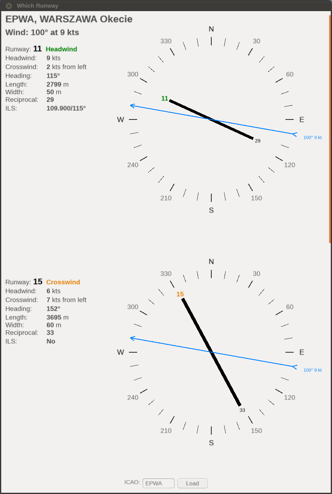

FlightGear "Which Runway" Add-on
================================

This add-on uses the METAR to indicate which runway is best for takeoff or landing. It also calculates headwind, crosswind and tailwind forces for the each runway of the airport.

## Installation

Installation is standard:

1. Download "Which Runway" add-on and unzip it.

2. In Launcher go to "Add-ons" tab. Click "Add" button by "Add-on Module folders" section and select folder with unzipped "Which Runway" add-on directory (or add command line option: `--addon=/path/to/which-runway`), and click "Fly!".

## Using

This add-on adds a "Which Runway" item to the main menu, from which you select "Runways". A dialog box will open with 4 tabs:

1. **Nearest** displays the nearest airport, which will be automatically updated during the flight. At the bottom, there's a field to enter the ICAO code of any other airport and you also find buttons with the nearest airports within a 50 nautical mile radius. If you reach a different nearest airport, the data will always change to that nearest airport. To prevent the nearest airport from changing automatically, you can check the "Hold update" checkbox.
2. **Departure** show the airport selected as departure in Route Manager. This airport is automatically change only when you change it in Route Manager. At the bottom you can force a refresh of the METAR with the "Update METAR" button.
3. **Arrival** show the airport selected as arrival in Route Manager. This airport is automatically change only when you change it in Route Manager. At the bottom you can force a refresh of the METAR with the "Update METAR" button.
4. **Alternate** where at the bottom you can use input field for entering the ICAO code of any airport. This is the best place to enter any ICAO code because here the airport will never be changed by the program. Here you will also find buttons with the nearest airports within a 50 nautical mile radius.

Each tab contains information about the airport, the METAR, and the runways and their winds. Runways are sorted by which one is most exposed to headwinds. Wind data is always taken from the actual METAR. The METAR will be updated automatically every 15 minutes by FlightGear's mechanisms or by using the "Load"/"Update METAR" buttons.

**NOTE**: To download and use METAR data with this add-on, the add-on requires the "Live Data" weather scenario to be enabled. You can use this add-on with the weather scenario in offline mode, but wind and METAR data will not be displayed.

## Authors

- Roman "PlayeRom" Ludwicki (SP-ROM)

## License

"Which Runway" is an Open Source project and it is licensed under the GNU Public License v3 (GPLv3).
