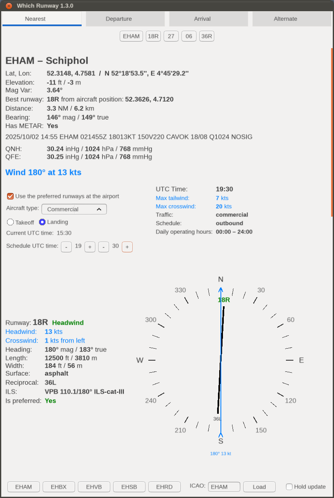

FlightGear "Which Runway" Add-on
================================

This add-on uses the METAR to indicate which runway is best for takeoff or landing. It also calculates headwind, crosswind and tailwind forces for the each runway of the airport.

## Installation

Installation is standard:

1. Download "Which Runway" add-on and unzip it.

2. In Launcher go to "Add-ons" tab. Click "Add" button by "Add-on Module folders" section and select folder with unzipped "Which Runway" add-on directory (or add command line option: `--addon=/path/to/which-runway`), and click "Fly!".

## Using

This add-on adds a "Which Runway" item to the main menu, from which you select "Runways". A dialog box will open with 4 tabs:

1. **Nearest** displays the nearest airport, which will be automatically updated during the flight. At the bottom, there's a field to enter the ICAO code of any other airport and you also find buttons with the nearest airports within a 50 nautical mile radius. If you reach a different nearest airport, the data will always change to that nearest airport. To prevent the nearest airport from changing automatically, you can check the "Hold update" checkbox.
2. **Departure** show the airport selected as departure in Route Manager. This airport is automatically change only when you change it in Route Manager. At the bottom you can force a refresh of the METAR with the "Update METAR" button.
3. **Arrival** show the airport selected as arrival in Route Manager. This airport is automatically change only when you change it in Route Manager. At the bottom you can force a refresh of the METAR with the "Update METAR" button.
4. **Alternate** where at the bottom you can use input field for entering the ICAO code of any airport. This is the best place to enter any ICAO code because here the airport will never be changed by the program. Here you will also find buttons with the nearest airports within a 50 nautical mile radius.

Each tab contains information about the airport, the METAR, and the runways and their winds. Runways are sorted by which one is most exposed to headwinds. Wind data is always taken from the actual METAR. The METAR will be updated automatically every 15 minutes by FlightGear's mechanisms or by using the "Load"/"Update METAR" buttons.

If the airport does not have a METAR, the METAR is taken from another nearest airport, within a maximum range of 30 NM. A warning is then displayed, indicating which airport the METAR is from and how far away that airport is. This is useful in situations where smaller airports don't have METARs but are close enough to another larger airport that it can be assumed there won't be much, if any, difference in weather. This allows you to obtain some weather conditions, such as wind and barometric pressure, even at airports without a METAR, which wasn't so easily possible without this add-on.

If there is no other airport with a METAR within 30 NM, information about the airport and its runways will be displayed, but without wind and other weather data. This means that the runways are displayed as they appear in the database and are not sorted by best wind.

**NOTE**: To download and use METAR data with this add-on, the add-on requires the "Live Data" weather scenario to be enabled. You can use this add-on with the weather scenario in offline mode, but wind and METAR data will not be displayed.

The illustration shows the case when the airport does not have a METAR, but the METAR was downloaded from the nearest other airport:

The illustration shows a case when the airport does not have a METAR and no other airport with a METAR was found within 30 NM:

The illustration shows the case when the wind is variable:

The illustration shows a case of gusty wind:

## Development

This section is for developers only, if you are a user who just uses the add-on, you should not bother with this.

### The `.env` file

For more convenient development, this add-on recognizes an `.env` file, where you can set certain variables. The `.env` file is best created by making a copy of the `.env.example` file and renaming it to `.env`. The `.env` file is on the `.gitignore` list, making it more convenient to use than modifying the code in the repository.

The add-on recognizes the following variables in the `.env` file:

1. `DEV_MODE` which takes the values `​​true` or `false` (or `1`/`0`). Setting this variable to `true` will add a "Dev Reload" item to the add-on's menu. This menu is used to reload all of the add-on's Nasal code.

2. `MY_LOG_LEVEL` - here you can specify the logging level for logs added using the `Log.print()` method. Possible values: `LOG_ALERT`, `LOG_WARN`, `LOG_INFO`, `LOG_DEBUG` or `LOG_BULK`.

After changing these values, you need to reload the Nasal code using the "Dev Reload" menu item or the `:Yaw` multi-key command, or, as a last resort, restart the entire simulator.

### Multi-key command

To reset the add-on's Nasal scripts, you can also use the multi-key command: `:Yaw`, which always works regardless of the `DEV_MODE` value in the `.env` file. This way, you are always able to reset the add-on's Nasal code, even if you don't have a "Dev Reload" menu item.

### Diagram

## Authors

- Roman "PlayeRom" Ludwicki (SP-ROM)

## License

"Which Runway" is an Open Source project and it is licensed under the GNU Public License v3 (GPLv3).
