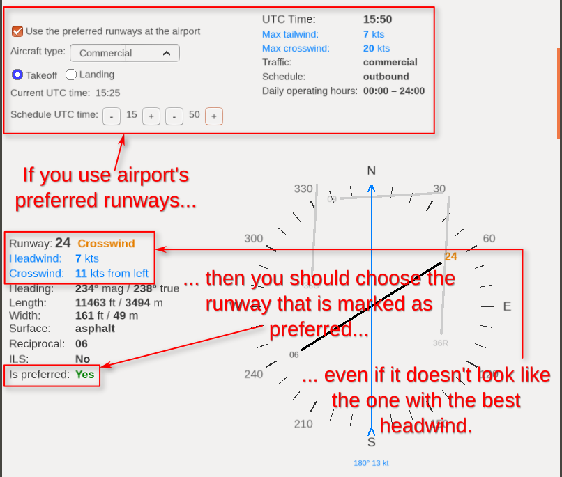
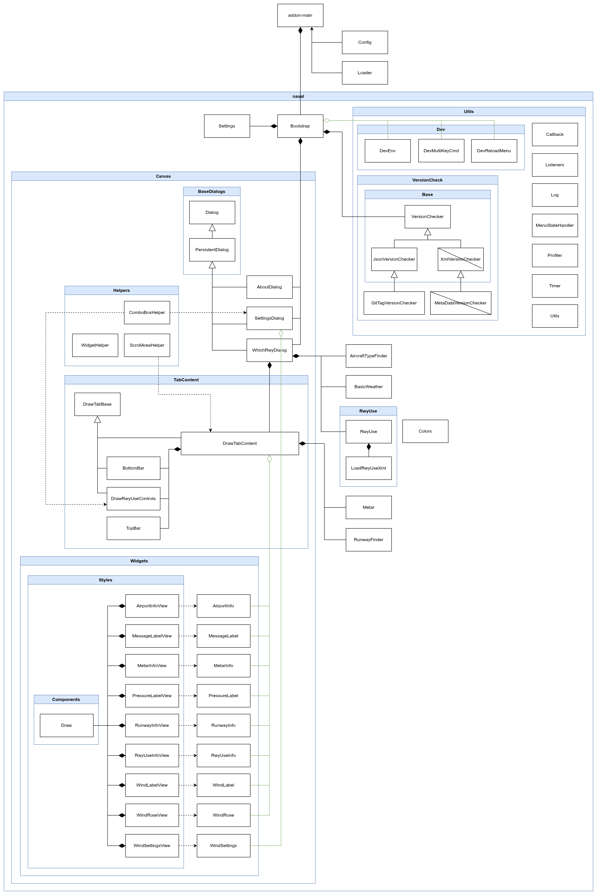

FlightGear "Which Runway" Add-on
================================

This add-on uses METAR data and preferred runways at the airport (ICAO.rwyuse.xml files) to indicate the best runway for takeoff or landing. It also calculates headwinds, crosswinds, and tailwinds for each airport runway (which can be useful for input into the MCDU), and provides a wealth of information about the airport and its runways, along with a graphical representation on a wind rose.

## Installation

Installation is standard:

1. Download "Which Runway" add-on and unzip it.

2. In Launcher go to "Add-ons" tab. Click "Add" button by "Add-on Module folders" section and select folder with unzipped "Which Runway" add-on directory (or add command line option: `--addon=/path/to/which-runway`), and click "Fly!".

## Using

This add-on adds a "Which Runway" item to the main menu, from which you select "Runways...". A dialog box will open with 4 tabs:

1. **Nearest** displays the nearest airport, which will be automatically updated during the flight. At the bottom, there's a field to enter the ICAO code of any other airport and you also find buttons with the nearest airports within a 50 nautical mile radius. If you reach a different nearest airport, the data will always change to that nearest airport. To prevent the nearest airport from changing automatically, you can check the "Hold update" checkbox.
2. **Departure** show the airport selected as departure in Route Manager. This airport is automatically change only when you change it in Route Manager. At the bottom you can force a refresh of the weather conditions with the "Update METAR" button.
3. **Arrival** show the airport selected as arrival in Route Manager. This airport is automatically change only when you change it in Route Manager. At the bottom you can force a refresh of the weather conditions with the "Update METAR" button.
4. **Alternate** where at the bottom you can use input field for entering the ICAO code of any airport. This is the best place to enter any ICAO code because here the airport will never be changed by the program. Here you will also find buttons with the nearest airports within a 50 nautical mile radius.

Each tab contains information about the airport, METAR, and runways and their winds. Runways are sorted by preferred runways at the airport or by those most exposed to headwinds. Wind data is always taken from the current METAR or manual configuration if used for Basic Weather.

The add-on fully recognizes your weather usage, including the following configurations:

1. Real-time METARs ("Live Data" scenario).
2. Weather scenarios with an offline METAR.
3. Basic Weather with Manual Configuration (without a METAR).

### Real-time METARs

Using real weather conditions is the best option for this add-on, and the most realistic. With "Live Data" scenario, the add-on retrieves the METAR for a given airport and obtains weather information from it.

If the airport does not have a METAR, the METAR is taken from another nearest airport, within a maximum range of 30 NM by default (it can be change in Settings). A warning is then displayed, indicating which airport the METAR is from and how far away that airport is. This is useful in situations where smaller airports don't have METARs but are close enough to another larger airport that it can be assumed there won't be much, if any, difference in weather. This allows you to obtain some weather conditions, such as wind and barometric pressure, even at airports without a METAR, which wasn't so easily possible in FlightGear without this add-on.

If there is no other airport with a METAR within 30 NM, information about the airport and its runways will be displayed, but without wind and other weather data.

The METAR will be updated automatically every 15 minutes by FlightGear's mechanisms or by using the "Load"/"Update METAR" buttons.

### Weather scenarios with an offline METAR.

If you choose the offline weather scenario, the same METAR will be used for all airports. The add-on will display a warning that the METAR is from offline scenario.

### Basic Weather with Manual Configuration

With this configuration, METAR is not used, but weather conditions, such as QNH pressure, wind direction and speed, are taken from the manual configuration. Therefore, weather conditions are still available and are the same for all airports (Basic Weather with manual configuration it's a global weather).

## Airport information

Airport information is always displayed at the top of the tab:

1. **ICAO** code and airport name.
2. **Lat, Lon** – geographical coordinates of the airport in 2 formats.
3. **Elevation** – airport elevation in feet and meters.
4. **Mag Var** – magnetic variation at the airport.
5. **Best runway from aircraft position** – this is not the best runway due to the wind, nor is it the airport's preferred runway, it is the runway you can choose if you need to land immediately in case of an emergency, as it's the runway your aircraft is most conveniently positioned to land on. This means you won't have to perform as many maneuvers to land on it. This value will change dynamically.
6. **Distance** – distance from your position to the airport in nautical miles and kilometers. This value will change dynamically.
7. **Bearing** – bearing from your position to the airport (magnetic and true). This value will change dynamically.
8. **Has METAR** – information as to whether the airport provides its own METAR report.
9. **METAR** – raw METAR from the current airport, if available, or the nearest other airport.
10. **QNH** – atmospheric pressure relative to mean sea level as given by MATAR, in 3 units. This information may change as the METAR changes.
11. **QEF** – atmospheric pressure relative to the airport elevation as given by MATAR, in 3 units. This information may change as the METAR changes.
12. **Wind** – information from METAR about the true direction of the wind and its speed (and wind gusts, if any).

## Preferred runways at the airport

Some airports, especially larger ones, include a file with the extension `*.rwyuse.xml` in their scenery. This file defines schedules for specific aircraft types and the preferred runways for takeoff and landing within a given schedule. The `rwyuse.xml` file also contains information about the maximum allowable tailwind and crosswind. Runways in the `rwyuse.xml` file are presented in columns, as pairs for takeoff and landing (or threes, e.g. 1 runway for landing, 2 for takeoff). If at least one runway in the first column of preferred runways does not meet the wind requirements, the next column is considered, and so on, until a column containing preferred runways is found. This means that the preferred runway may not necessarily be the one best located for the headwind. This is due to noise reduction, traffic volume, runway length, and other factors.

The "Which Runway" add-on by default tries to load the `rwyuse.xml` file (if it exists for a given airport), and takes into account the preferred runways there.

If the airport has an `rwyuse.xml` file, it will be visible with an additional set of controls and information.

Controls:

1. **Use the preferred runways at the airport** checkbox – this will be enabled by default to use information from `rwyuse.xml` in current tab. However, you can always uncheck this option, which means disabling the `rwyuse.xml` file, and then the runways will be presented simply by the highest headwind. If you want to globally disable the use of preferred runways, go to the "Which runway" -> "Settings..." menu.
2. **Aircraft type** combobox – schedules for specific aircraft types are created in the `rwyuse.xml` file. Therefore, first make sure you have the correct aircraft type set:
    1. `Commercial` – airliners,
    2. `General Aviation`,
    3. `Ultralight`,
    4. `Military`.

    Not all airports have schedules for `Ultralight` and `Military`. If `Ultralight` is not present, `General` will be used, even though `Ultralight` is selected. If `Military` is not present, `Commercial` will be used. And if `General` is not specified, `Commercial` will also be used. Changing the aircraft in any tab will change the aircraft in every tab. This is convenient because we don't have to repeat this for every tab.

    
3. Radio buttons **Takeoff** and **Lending** – here you must select whether you are interested in taking off or landing at a given airport. For the "Departure" tab, `takeoff` is selected and cannot be changed. For "Arrival", `landing` is always selected. The values ​​can be changed on the "Nearest" and "Alternate" tabs.
4. **Current UTC time** simply displays the current UTC time in the simulator to help set the schedule time. This time automatically updates.
5. **Schedule UTC time** – here you should select the UTC time for takeoff or landing. As I mentioned, airports have their schedules based on time intervals in UTC, so it's important to enter the correct time. For example, if your flight will last another 2 hours, set the UTC time 2 hours ahead to match your expected landing time. You will then receive the correct landing schedule. The minutes change every 10 minutes so that you don't have to click too much, which I think is enough to determine the arrival/departure time.

On the right side, you'll find additional information:

1. **UTC Time** – the time used for the schedule. Remember to set the correct takeoff/landing time, which will mostly be sometime in the future.
2. **Max tailwind** – the maximum allowable tailwind. If the runway has a tailwind greater than the value specified here, this will be marked as not preferred.
3. **Max crosswind** – the maximum allowable crosswind. If the runway has a crosswind greater than the value specified here, this will be marked as not preferred.
4. **Traffic** – the aircraft type used. This should be the same type as you selected in the "Aircraft type" combo box, but this won't always be the case. If the airport doesn't contain any data for the selected aircraft, this value is changed as described above, for the "Aircraft type" option.
5. **Schedule** – the name of the schedule from the `rwyuse.xml` file that corresponds to the given UTC time and aircraft/traffic. If `n/a` is displayed, it means the airport is not operational for the selected aircraft type at the selected UTC time. Runways will then be displayed simply by the highest headwind, without preferred runways. The values ​​found here may vary and depend on the airport, but here are some of them:
    - `night` – night schedule, where preferred runways may be selected specifically for noise reasons;
    - `day` – a general schedule for the entire day;
    - `offpeak` – the end of peak traffic;
    - `inbound` – heavy traffic arriving at the airport, in which case there may be more preferred runways for landing;
    - `outbound` – heavy traffic departing from the airport, in which case there may be more preferred runways for takeoff;
    - `general`, `ga` – most often one schedule for all general aviation traffic;
    - `commercial` – most often one schedule for all airline traffic;
    - `always` – some general schedule.
6. **Daily operating hours** – the 24-hour range of hours during which the selected traffic can operate, meaning that the airport has a defined schedule for these hours. If you set the UTC time outside the range of hours specified here, you receive an amber warning and the Schedule will indicate `n/a`.

If you're using preferred runways for an airport, then:

1. The preferred runways will be displayed first. They will have the additional information **Is preferred: Yes**. Typically, there will be only one runway, or possibly two, for large airports. This is the runway you should select.
2. Not all runways will be displayed here, only those that were on the airport's preferred list for a given schedule.
3. If at least one of the runways from a column in the `rwyuse.xml` file does not meet the tailwind and crosswind criteria, then all runways in that column are marked as **Is preferred: No**.
4. If all runways are rejected due to failure to meet the tailwind and crosswind criteria, then the runways will simply be sorted according to the highest headwind. This will be accompanied by the warning "No preferred runway meets the wind criteria, so the best headwind is used."
5. If, for the selected aircraft type, the airport is not operational at the selected UTC time, then the runways will simply be sorted according to the highest headwind. This will be accompanied by the warning "No preferred runway for the selected time, so the best headwind is used."
6. If the wind is variable, the criteria for max tailwind and crosswind are not checked, which means that no runways are rejected from the preferred ones.

For more information about `rwyuse.xml` file see [article on the FG wiki](https://wiki.flightgear.org/AI_Traffic#Runway_Usage_Configuration).

### Comments

Some airports have incorrectly created `rwyuse.xml` files. For example, the number of runways in a column is not the same, or they have multiple schedule entries for the same aircraft type, each with the same time range. Such cases can produce illogical results or won't be fully supported. The example of how this should be done correctly, and what I used as a basis, is the `EHAM.rwyuse.xml` file, where the aircraft type has a single schedule from 00:00Z to 24:00Z, and the preferred runway lists have the same number of columns.

### Preferred runways at the airport and compatibility issues

Currently, FlightGear uses the preferred runways at the airport (if available) only for computer-controlled traffic. Therefore, if you start a session on a runway, your aircraft will be placed on the runway based on the highest headwind, without taking into account the preferred runways at the airport. The good news is that this is recognized and marked with a FIXME comment in the FlightGear code :)

Other add-ons, such as "Red Griffin ATC" (version 2.3.0 at the moment), work similarly. If you haven't created flight plan yet, and you ask "Red Griffin ATC" for departure information, you'll receive a takeoff runway based on the highest headwind only, and this will usually not be consistent with what “Which Runway” indicates when using preferred runways.

## Pictures

The illustration shows the case when the airport does not have a METAR, but the METAR was downloaded from the nearest other airport:

The illustration shows a case when the airport does not have a METAR and no other airport with a METAR was found within 30 NM:

The illustration shows the case when the wind is variable:

The illustration shows a case of gusty wind:

## Keys

The main window of the add-on supports the following keys:

- `1` – switch to the Nearest tab.
- `2` – switch to the Departure tab.
- `3` – switch to the Arrival tab.
- `4` – switch to the Alternate tab.
- `Up`/`Down` – scroll content with small increments (20 px).
- `PageUp`/`PageDown` – scroll the content by one visible screen.
- `Esc` – close the window.

## Settings Dialog

From the "Which Runway" -> "Settings..." menu, you can open the global settings window. The following options are available:

1. `Max range for nearest METAR in NM` – here you can specify, in nautical miles, how far away the nearest METAR will be searched if the airport does not have its own METAR. The default value is 30 NM.
2. `Preferred runways at the airport` – here you can enable/disable the use of preferred runways by the airport (`ICAO.rwyuse.xml` files). This is enabled by default. If you disable this option, the preferred runways at the airport will not be included at all (even if they exist), and the add-on will always display runways sorted by best headwind.
3. `Set thresholds for HW, XW and TW` – the figure shows how the headwind, crosswind, and tailwind zones are set. By default, the add-on will consider a wind to be a headwind if it blows from a direction within 45° of the aircraft's nose. It will then consider a crosswind if it blows from a direction between 45° and 90° (from both the right and left). Any wind direction beyond 90° will be considered a tailwind.

    Below are the controls for changing these angles. The "<" and ">" buttons change the angle by 1°, and the "<<" and ">>" buttons change the angle by 5°. The "Default" button resets the settings to 45° for HW and 90° for XW.

    **These settings do not affect the selection of runways**, but only affect the information about whether the wind is considered headwind, crosswind, or tailwind.

## Development

This section is for developers only, if you are a user who just uses the add-on, you should not bother with this section.

### The `.env` file

For more convenient development, this add-on recognizes an `.env` file, where you can set certain variables. The `.env` file is best created by making a copy of the `.env.example` file and renaming it to `.env`. The `.env` file is on the `.gitignore` list, making it more convenient to use than modifying the code in the repository.

The add-on recognizes the following variables in the `.env` file:

1. `DEV_MODE` which takes the values `​​true` or `false` (or `1`/`0`). Setting this variable to `true` will enable possibility to use `RELOAD_MENU` and `RELOAD_MULTIKEY_CMD` variable.
2. `RELOAD_MENU` which takes the values `​​true` or `false` (or `1`/`0`). Setting this variable to `true` will add a "Dev Reload" item to the add-on's menu. This menu is used to reload all of the add-on's Nasal code.
3. `RELOAD_MULTIKEY_CMD` is using to set multi-key command to reload the add-on's Nasal code. As default `:Yawr`.
4. `MY_LOG_LEVEL` – here you can specify the logging level for logs added using the `Log.print()` method. Possible values: `LOG_ALERT`, `LOG_WARN`, `LOG_INFO`, `LOG_DEBUG` or `LOG_BULK`. If you set, for example, `LOG_INFO`, then logs using `Log.print()` will be logged with this flag, which means that to see them you need to run the simulator with the log level at the same level or higher: `--log-level=info`.

After changing these values, you need to reload the Nasal code using the "Dev Reload" menu item or the `:Yawr` multi-key command, or, as a last resort, restart the entire simulator.

### Class Diagram

## Authors

- Roman "PlayeRom" Ludwicki (SP-ROM)

## License

"Which Runway" is an Open Source project and it is licensed under the GNU Public License v3 (GPLv3).
